# FDgolf — Architecture

CIBC Capital Markets Golf Tournament · June 22 2026 · Granite Ridge Golf Club, Milton ON

---

## Table of Contents

1. [System Overview](#system-overview)
2. [Tech Stack](#tech-stack)
3. [Application Architecture](#application-architecture)
4. [Route & Auth Flow](#route--auth-flow)
5. [Database Schema](#database-schema)
6. [Shot Recording Flow](#shot-recording-flow)
7. [Offline Sync Engine](#offline-sync-engine)
8. [Real-time Leaderboard](#real-time-leaderboard)
9. [User Journeys](#user-journeys)
10. [Key Design Decisions](#key-design-decisions)

---

## System Overview

FDgolf is a mobile-first tournament scoring app. One phone per foursome records shots during a shotgun-start Best Ball round; scores propagate in real time to a public leaderboard projected at the clubhouse.

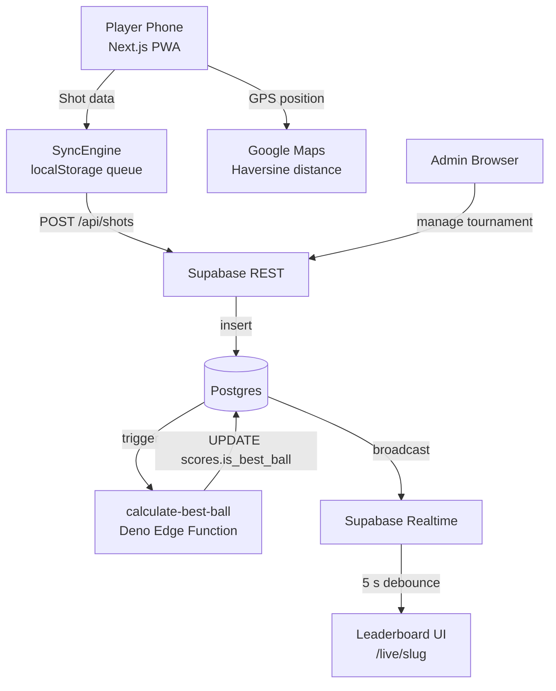

---

## Tech Stack

| Layer | Choice | Notes |
|-------|--------|-------|
| Framework | Next.js 14 App Router + TypeScript | Server components for data fetching; client components for interactive UI |
| Styling | Tailwind CSS v3 + shadcn/ui | Radix-based components; default style (not new-york) for Tailwind v3 compatibility |
| Auth | Supabase Auth + `@supabase/ssr` | Cookie-based sessions; magic link for player registration |
| Database | Supabase Postgres | RLS on all tables; service role key used only in Edge Function |
| Realtime | Supabase Realtime | Scores channel with 5 s client-side debounce |
| Offline | `localStorage` write queue | `SyncEngine` singleton; auto-flush on reconnect; max 5 retries |
| GPS | Google Maps JS API v2 + Haversine | SSR-safe dynamic import; `useRef` cache prevents re-loads |
| Deploy | Vercel | ISR on `/live/[slug]` (revalidate 30 s) |

---

## Application Architecture

Route groups map to user roles:

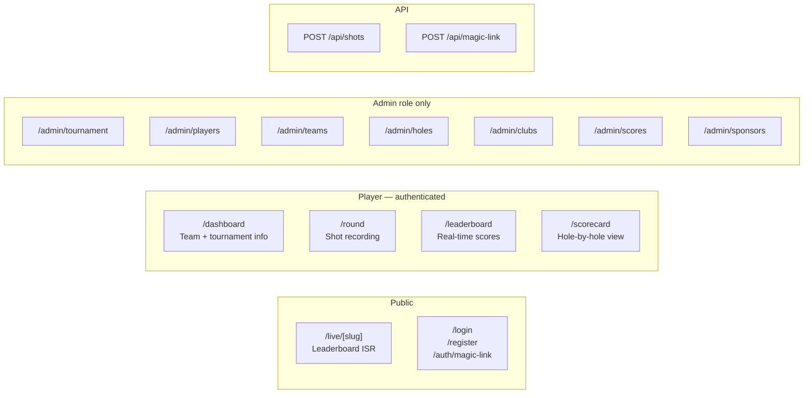

### Component Layers

```
src/
├── app/                    # Pages (server components by default)
│   ├── (auth)/             # Login, register, magic-link handler
│   ├── (player)/           # Dashboard, round, leaderboard, scorecard
│   ├── (admin)/            # 7 admin management pages
│   ├── api/                # Route handlers (Node.js runtime)
│   └── live/[slug]/        # Public leaderboard (ISR, no auth)
├── components/             # Shared UI
│   ├── app-header.tsx      # Full/compact variants + AI/Run™ pill
│   ├── hole-map.tsx        # Google Maps (dynamic import, SSR-safe)
│   ├── leaderboard-table.tsx
│   ├── offline-indicator.tsx
│   └── ...
├── hooks/
│   ├── use-gps.ts          # navigator.geolocation wrapper
│   ├── use-realtime-scores.ts  # Supabase channel + 5 s debounce
│   └── use-sync-engine.ts  # useSyncExternalStore adapter
└── lib/
    ├── types.ts            # All 9 entity interfaces
    ├── scoring.ts          # Best Ball calculation utilities
    ├── sync-engine.ts      # Offline write queue singleton
    ├── gps.ts              # GpsPosition + Haversine
    └── supabase/           # client.ts, server.ts, middleware.ts
```

---

## Route & Auth Flow

Middleware (`src/lib/supabase/middleware.ts`) runs on every non-static request:

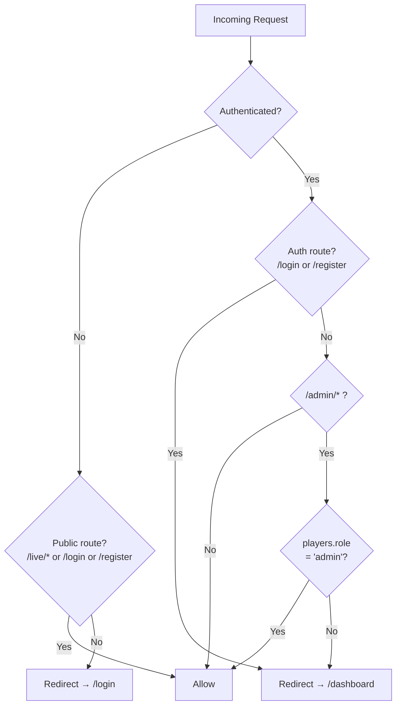

### Magic Link Registration Flow

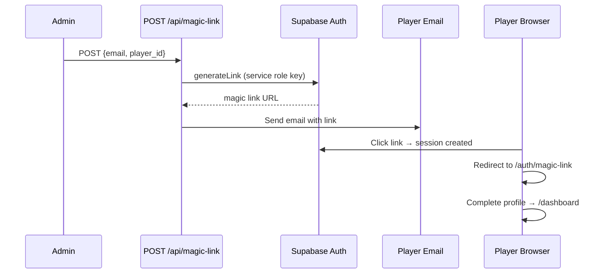

---

## Database Schema

9 tables. All have RLS enabled; all reads are public; writes are restricted by role.

```mermaid
erDiagram
    tournaments {
        uuid id PK
        text name
        text slug UK
        date date
        text format
        text venue
        text status "setup|active|paused|completed"
    }

    holes {
        uuid id PK
        uuid tournament_id FK
        int hole_number
        int par
        int handicap
        float pin_lat
        float pin_lng
    }

    teams {
        uuid id PK
        uuid tournament_id FK
        int team_number
        text team_name
        int starting_hole
        int max_players "2..6 default 4"
        uuid captain_id FK "deferred → players"
    }

    players {
        uuid id PK
        uuid auth_user_id UK
        text name
        text email UK
        uuid team_id FK
        text role "player|admin|tournament_organizer"
    }

    clubs {
        uuid id PK
        text name
        text category "wood|hybrid|iron|wedge|putter"
        int sort_order
        bool is_active
    }

    round_states {
        uuid id PK
        uuid team_id FK UK
        int current_hole
        uuid active_player_id FK
        text status "not_started|in_progress|completed"
    }

    shots {
        uuid id PK
        uuid player_id FK
        uuid tournament_id FK
        int hole_number
        int shot_number
        text club_name
        float start_lat
        float start_lng
        text outcome "in_play|out_of_bounds|mulligan|sunk"
    }

    scores {
        uuid id PK
        uuid player_id FK
        uuid team_id FK
        uuid tournament_id FK
        int hole_number
        int strokes
        bool is_best_ball
        uuid override_by FK
    }

    sponsors {
        uuid id PK
        uuid tournament_id FK
        text name
        text logo_url
        int display_order
        bool is_active
    }

    tournaments ||--o{ holes : "has"
    tournaments ||--o{ teams : "has"
    tournaments ||--o{ scores : "has"
    tournaments ||--o{ sponsors : "has"
    teams ||--o{ players : "contains"
    teams ||--|| round_states : "has"
    teams ||--o{ scores : "receives"
    players ||--o{ shots : "records"
    players ||--o{ scores : "has"
    players }o--|| teams : "captains"
```

### Key Database Notes

- **`teams.captain_id`** has no inline FK. The constraint `fk_teams_captain` is added via `ALTER TABLE` after both `teams` and `players` exist (circular dependency).
- **`scores.is_best_ball`** is set exclusively by the `calculate-best-ball` Deno Edge Function using the service role key — never set directly by the client.
- **`scores.override_by` / `override_at`** provide an audit trail for admin score corrections.
- **`get_leaderboard(tournament_id)`** RPC joins `teams → scores (is_best_ball=true) → holes` and returns rows sorted ascending by `(total_score - par_total)`.

---

## Shot Recording Flow

The round page is the core user interaction. One phone per foursome records every shot.

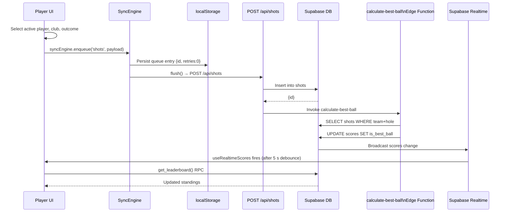

---

## Offline Sync Engine

`SyncEngine` (`src/lib/sync-engine.ts`) is a singleton that survives page refreshes via `localStorage`.

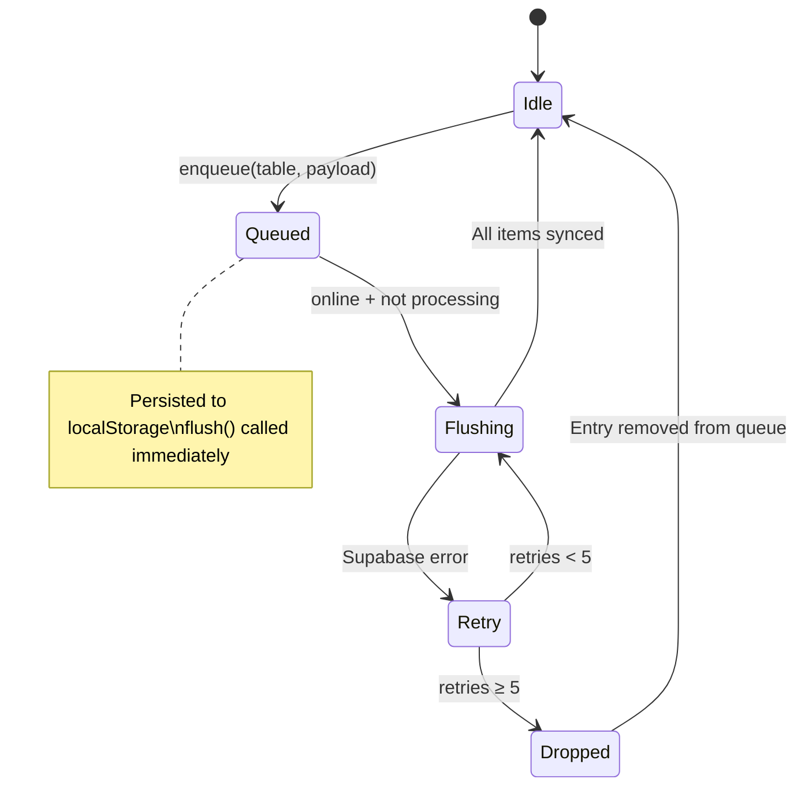

- Auto-flush triggers: `window.addEventListener('online', ...)` and a 10 s `setInterval`.
- `OfflineIndicator` component reads `pendingCount` via `useSyncExternalStore` — no polling.

---

## Real-time Leaderboard

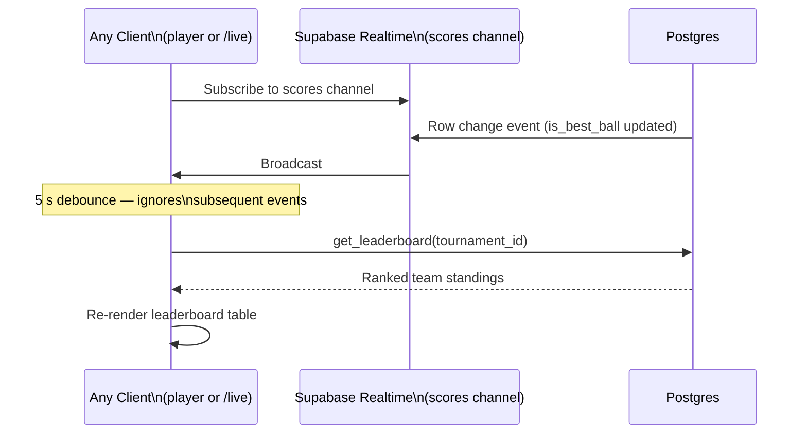

The 5 s debounce in `useRealtimeScores` prevents a 125-client storm from all firing simultaneous RPC calls when a single score update arrives.

---

## User Journeys

### 1. Admin: Tournament Setup (June 21)

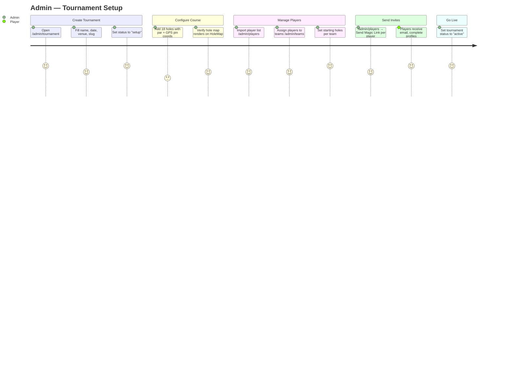

### 2. Player: Tournament Day (June 22)

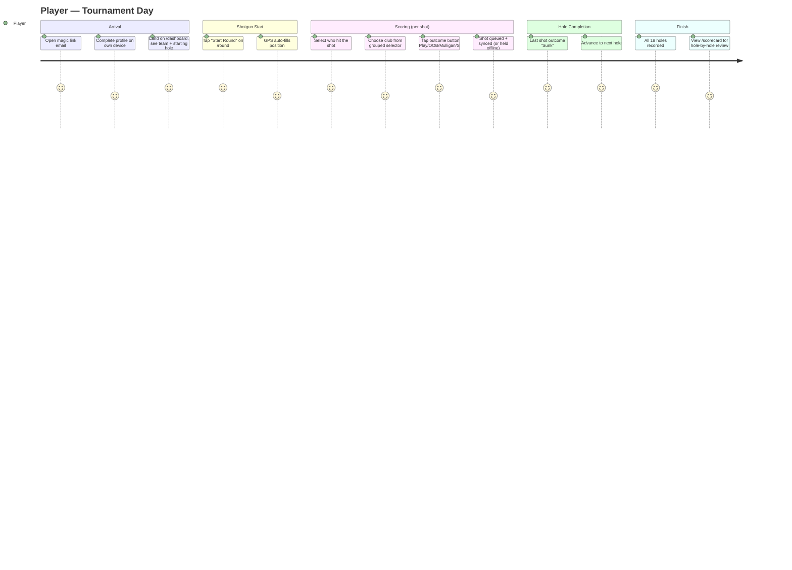

### 3. Clubhouse: Live Leaderboard

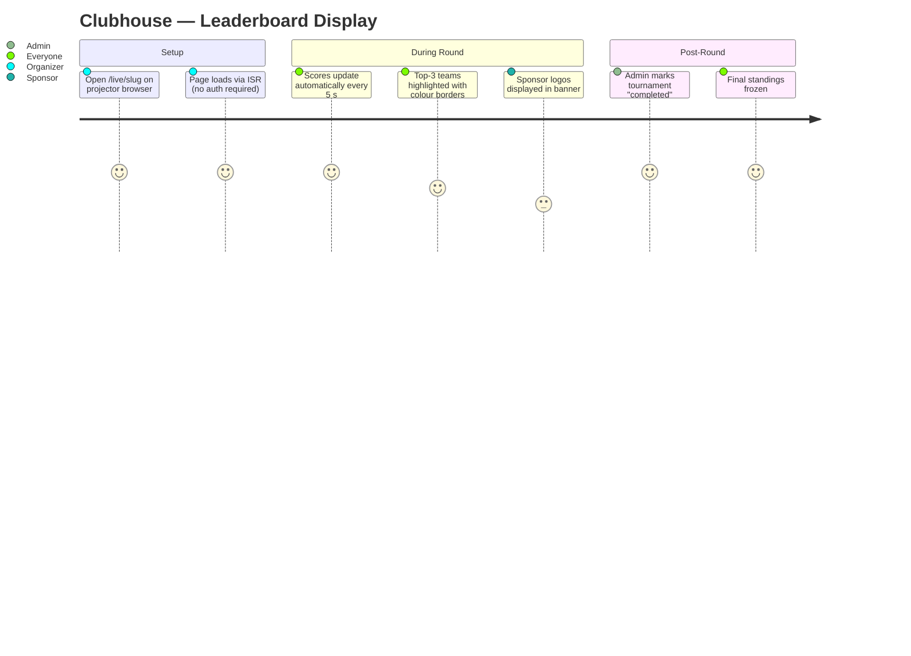

### 4. Admin: Score Override

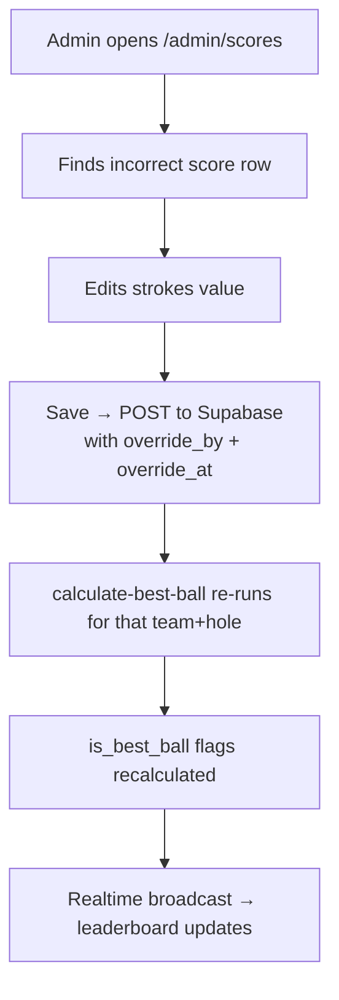

---

## Key Design Decisions

| Decision | Rationale |
|----------|-----------|
| Best Ball calculated server-side (Deno Edge Function) | Min-stroke selection requires seeing all players' scores for a hole simultaneously; client can't do this safely without race conditions. Service role key bypasses RLS. |
| `SyncEngine` localStorage queue, max 5 retries | Offline-first: phone tunnels, crowd congestion, or bad signal on course. Queue survives page refresh. Items dropped after 5 failures to prevent infinite retry on bad data. |
| 5 s debounce on `useRealtimeScores` | 125 concurrent clients on a single Supabase Realtime channel; one score update would trigger 125 simultaneous `get_leaderboard()` RPC calls without it. |
| `supabase/functions` excluded from `tsconfig.json` | Deno Edge Functions use CDN imports (`https://esm.sh/...`) that are invalid in Node.js TypeScript. Separate compilation context required. |
| Deferred `fk_teams_captain` via `ALTER TABLE` | `teams` references `players` (captain) and `players` references `teams` (team_id) — a circular FK that can't be resolved with inline constraints. |
| Google Maps SDK loaded via `useRef` cache | The `@googlemaps/js-api-loader` is a stateful singleton; calling `load()` twice on the same page triggers billing events and console errors. `useRef` ensures a single load per component mount. |
| `live/[slug]` uses ISR (`revalidate: 30`) | Public leaderboard is projector-facing — must work even if the Supabase Realtime WebSocket drops. 30 s fallback ensures the page stays reasonably fresh without a persistent connection. |
| `scores` readable without auth (RLS public select) | The `/live/[slug]` route is unauthenticated; server component must be able to read scores to render the initial HTML for ISR. |
